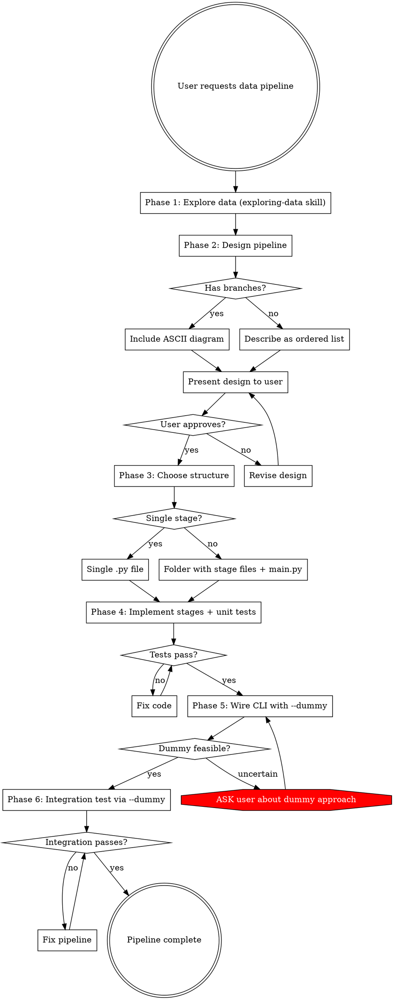

# Building Data Pipelines

## Overview

Reproducible, testable data processing pipelines as CLI tools. Core principle: **understand the data and get design approval before writing any transformation code.**

## When to Use

- User asks to prepare, transform, filter, stratify, or reorganize a dataset
- User needs batch processing: images, CSVs, text files, audio, etc.
- User asks to build a data pipeline, ETL script, or processing workflow
- User needs dataset splits (train/val/test), augmentation, or format conversion

**Do NOT use when:**
- User wants to explore/understand data only (use `exploring-data`)
- User wants EDA or visualizations (use `creating-eda-notebooks`)
- User wants a one-off data query or single transformation (just write the code)

## Workflow



## Phase 1: Explore the Data

**STOP. Do not design or code anything yet.**

**REQUIRED SUB-SKILL:** Use the `exploring-data` skill to understand the data.

Run the full exploration workflow: map structure, inspect files, collect unknowns, ask user about ambiguous names, produce summary.

**Why this is mandatory:** Without understanding the actual data — column names, types, value ranges, edge cases, file formats — you WILL write transformation code that breaks on real data. The user's description of their data is never complete.

If the `exploring-data` skill cannot be loaded, **stop and tell the user** before proceeding. Do not substitute ad-hoc exploration.

## Phase 2: Design the Pipeline

Based on data understanding, design the transformation pipeline. The design must include:

1. **Input description** — what comes in (format, location, expected structure)
2. **Stages** — ordered list of transformations, each with:
   - Name (verb-noun: `filter_corrupted`, `resize_images`, `stratify_split`)
   - Input → Output description
   - Key parameters
3. **Output description** — what comes out (format, folder structure, file naming)
4. **Reproducibility notes** — which stages involve randomness, what seed controls them

### Branching Pipelines

If the pipeline is NOT a straightforward chain (has branches, conditional paths, multiple outputs from one stage, or parallel tracks), use an ASCII diagram. **A stage that produces multiple outputs (e.g., train/val/test splits) counts as a branch.** When in doubt, draw the diagram.

```
Input CSV
    │
    ├──► filter_valid_rows ──► valid.csv
    │                              │
    │                         stratify_split
    │                        /      |       \
    │                    train/   val/    test/
    │
    └──► filter_invalid_rows ──► rejected.csv (audit log)
```

For straightforward chains, a numbered list is sufficient.

**Present the design to the user and WAIT for approval. Do NOT start implementing until the user says "go".** If operating autonomously without a user to approve, output the design as a clearly-labeled `DESIGN PROPOSAL` block and halt. Do not self-approve.

## Phase 3: Choose Structure

### Single-file pipeline

Use when the pipeline has **one logical stage** or is a simple chain of trivial operations:
- Reorganize folders
- Aggregate data from CSVs into one CSV
- Rename files by pattern
- Simple format conversion

Structure:
```
pipeline.py          # CLI tool with all logic
test_pipeline.py     # Unit tests for transformation functions
```

### Multi-stage pipeline

Use when the pipeline has **multiple distinct stages** (fetch, transform, filter, aggregate, split, etc.):

Structure:
```
my_pipeline/
    main.py              # CLI entry point — owns ALL paths
    stage_filter.py      # Stage 1: filtering logic
    stage_transform.py   # Stage 2: transformation logic
    stage_split.py       # Stage 3: splitting logic
    tests/
        test_filter.py
        test_transform.py
        test_split.py
```

**Decision rule:** If you listed 2+ named stages in your Phase 2 design (each with its own input/output description), use the multi-stage structure.

## Phase 4: Implement Stages + Unit Tests

### Stage Function Rules

1. **Stateless.** No module-level state, no cached data, no stored paths. If using classes for stages, instances must NOT store paths or accumulated data as instance variables. Prefer plain functions over stateful classes.
2. **All inputs as arguments.** Data, paths, parameters — everything passed in. **NEVER hardcode file paths or directory names inside a stage.** Pass paths as individual `Path` arguments, not as config objects — a stage receiving a config/dataclass can still derive new paths from it internally, which violates the rule.
3. **Pure transforms where possible.** Given the same input + seed, produce the same output.
4. **Type hints on all public functions.**
5. **Docstrings on all public functions.**

```python
# ✅ GOOD: stage receives everything it needs
def resize_images(
    image_paths: list[Path],
    output_dir: Path,
    target_size: tuple[int, int],
) -> list[Path]:
    """Resize images to target_size, save to output_dir.
    
    Returns list of paths to resized images.
    """
    ...

# ❌ BAD: stage owns its paths
def resize_images(image_paths: list[Path]) -> list[Path]:
    output_dir = Path("output/resized")  # NEVER DO THIS
    output_dir.mkdir(exist_ok=True)
    ...
```

### main.py Owns All Paths

**main.py is the ONLY place where paths are defined, constructed, or resolved.** Stages receive paths as arguments.

```python
# main.py
def main(input_dir: Path, output_dir: Path, seed: int, dummy: bool):
    # main.py constructs ALL paths
    filtered_dir = output_dir / "filtered"
    resized_dir = output_dir / "resized"
    train_dir = output_dir / "train"
    val_dir = output_dir / "val"
    test_dir = output_dir / "test"
    
    # Stages receive paths — they never construct them
    valid_images = filter_corrupted(list(input_dir.glob("*.jpg")))
    resized = resize_images(valid_images, resized_dir, (224, 224))
    stratify_split(resized, labels, train_dir, val_dir, test_dir, seed=seed)
```

### Reproducibility Requirements

**Every source of randomness MUST be controlled:**

```python
import random
import numpy as np

def set_seed(seed: int) -> None:
    """Set all random seeds for reproducibility."""
    random.seed(seed)
    np.random.seed(seed)
    # Add framework-specific seeds as needed (torch, sklearn, etc.)
```

- Seed is a **CLI argument** with a default (e.g., `--seed 42`)
- `set_seed()` is called ONCE in main, before any processing
- Stages that need randomness accept `seed` or `random_state` as parameter
- **Do NOT** rely on global seed inside stages — pass it explicitly
- Sort file listings before processing (`sorted(path.glob(...))`) — glob order is OS-dependent

### Unit Tests

Every transformation function gets tested with small, hand-crafted data. For stages that do I/O (reading/writing files), create small test fixture files in `tmp_path` rather than skipping the unit test — I/O stages still require unit tests. Tests must cover:

- **Happy path** — normal input produces expected output
- **Edge cases** — empty input, single item, all items filtered out
- **Determinism** — same input + seed = same output (run twice, compare). Write a determinism test for EVERY stage function, even those that appear deterministic — this catches hidden OS-level non-determinism (unsorted globs, dict ordering, threading).

```python
def test_resize_preserves_count():
    """All valid images should be resized."""
    images = [create_test_image(64, 64) for _ in range(5)]
    result = resize_images(images, tmp_path, (224, 224))
    assert len(result) == 5

def test_resize_deterministic():
    """Same input should produce identical output."""
    images = [create_test_image(64, 64) for _ in range(3)]
    r1 = resize_images(images, tmp_path / "r1", (224, 224))
    r2 = resize_images(images, tmp_path / "r2", (224, 224))
    for a, b in zip(r1, r2):
        assert read_bytes(a) == read_bytes(b)

def test_filter_empty_input():
    """Empty input should return empty list, not crash."""
    result = filter_corrupted([])
    assert result == []
```

**All tests must pass before proceeding to Phase 5.**

### Progress Reporting

Every stage MUST log:
- **Start message** with input count: `"Filtering corrupted images... (1000 images found)"`
- **tqdm progress bar** for the processing loop
- **End message** with output count: `"Filtering complete: 847/1000 images passed"`

**List comprehensions and generator expressions that iterate over data items count as processing loops.** Convert them to explicit `for` loops with tqdm. Do not use comprehensions to hide loops from tqdm.

```python
from tqdm import tqdm

def filter_corrupted(image_paths: list[Path]) -> list[Path]:
    print(f"Filtering corrupted images... ({len(image_paths)} images found)")
    valid = []
    for path in tqdm(image_paths, desc="Checking images"):
        if is_valid_image(path):
            valid.append(path)
    print(f"Filtering complete: {len(valid)}/{len(image_paths)} images passed")
    return valid
```

## Phase 5: Wire CLI with `--dummy`

### CLI Design

Use `argparse` from the standard library with clear, descriptive arguments. Do not substitute third-party CLI libraries (click, typer, fire) unless the user explicitly requests one.

```python
import argparse

def parse_args() -> argparse.Namespace:
    parser = argparse.ArgumentParser(
        description="Process images: filter corrupted, resize, stratified split."
    )
    parser.add_argument("--input-dir", type=Path, required=True,
                        help="Directory containing source images")
    parser.add_argument("--output-dir", type=Path, required=True,
                        help="Directory for processed output")
    parser.add_argument("--seed", type=int, default=42,
                        help="Random seed for reproducibility (default: 42)")
    parser.add_argument("--dummy", action="store_true",
                        help="Run on first 50 items only for quick verification")
    return parser.parse_args()
```

### The `--dummy` Flag

**This is NOT optional.** Every pipeline MUST support `--dummy` for quick end-to-end verification.

Implementation pattern:

```python
def main(input_dir: Path, output_dir: Path, seed: int, dummy: bool):
    items = sorted(input_dir.glob("*.jpg"))
    
    if dummy:
        items = items[:50]
        print(f"DUMMY MODE: Processing first {len(items)} items only")
    
    # ... rest of pipeline runs identically
```

**Dummy mode rules:**
- For CSV data: first 50 rows
- For image folders: first 50 images (alphabetically sorted)
- For multi-file datasets: first 50 files
- If dataset has fewer than 50 items, dummy mode silently processes all items — no warning needed
- Limit is applied ONCE at the start, before any processing
- All subsequent stages run identically — dummy mode does NOT change logic, only input size

### When Dummy Mode Is Unclear

If you cannot determine a sensible dummy subset (e.g., streaming data, graph data, interdependent records where taking 50 breaks referential integrity), **STOP and ask the user:**

> "I'm not sure how to implement `--dummy` mode for this pipeline because [specific reason]. Some options: (1) [option], (2) [option]. Which approach would you prefer, or should we skip `--dummy` for this pipeline?"

**Do NOT silently skip the dummy flag.** Do NOT implement a dummy flag that doesn't actually reduce the dataset. If dummy mode is clearly infeasible (not just unclear), still ASK the user — do not unilaterally decide to omit the flag. Either implement it properly or explicitly discuss with the user why it's problematic.

## Phase 6: Integration Test

Write an integration test that runs the full pipeline with `--dummy`:

```python
import subprocess
import sys

def test_pipeline_end_to_end(tmp_path):
    """Full pipeline smoke test using --dummy mode."""
    input_dir = tmp_path / "input"
    output_dir = tmp_path / "output"
    input_dir.mkdir()
    
    # Create minimal test fixtures
    for i in range(10):
        create_test_image(input_dir / f"img_{i:03d}.jpg", 64, 64)
    create_test_csv(input_dir / "labels.csv", num_rows=10)
    
    # Run pipeline via CLI (use sys.executable for correct Python env)
    result = subprocess.run(
        [sys.executable, "main.py",
         "--input-dir", str(input_dir),
         "--output-dir", str(output_dir),
         "--dummy", "--seed", "42"],
        capture_output=True, text=True,
    )
    assert result.returncode == 0, f"Pipeline failed:\n{result.stderr}"
    
    # Verify output structure exists
    assert (output_dir / "train").exists()
    assert (output_dir / "val").exists()
    assert (output_dir / "test").exists()
    
    # Verify reproducibility: run again, same output
    output_dir_2 = tmp_path / "output_2"
    result2 = subprocess.run(
        [sys.executable, "main.py",
         "--input-dir", str(input_dir),
         "--output-dir", str(output_dir_2),
         "--dummy", "--seed", "42"],
        capture_output=True, text=True,
    )
    assert result2.returncode == 0
    # Compare outputs...
```

**The integration test MUST:**
- Create its own test fixtures (never depend on real data)
- Use `--dummy` for speed
- Use a fixed `--seed`
- Verify output structure
- Verify the pipeline is reproducible (same seed → same output)

## Quick Reference

| Phase | What | Output | Blocked Until |
|---|---|---|---|
| 1. Explore | Understand data with `exploring-data` skill | Data summary | User provides data |
| 2. Design | Plan stages, draw diagram if branching | Design document for user | Data explored |
| 3. Structure | Choose single-file or multi-stage folder | Project skeleton | User approves design |
| 4. Implement | Write stages + unit tests | Tested transformation code | Structure chosen |
| 5. CLI | Wire argparse with `--dummy`, add logging/tqdm | Runnable CLI tool | Unit tests pass |
| 6. Integration | End-to-end test via `--dummy` | Passing integration test | CLI wired |

## Common Mistakes

| Mistake | Fix |
|---|---|
| Coding before understanding data | Phase 1 is mandatory. Use `exploring-data` skill. |
| Coding before user approves design | Phase 2 requires explicit user approval. WAIT. |
| Hardcoding paths inside stage functions | Stages receive ALL paths as arguments. main.py owns paths. |
| Skipping `--dummy` flag | EVERY pipeline gets `--dummy`. No exceptions. |
| Silently skipping dummy when it's hard | ASK the user. Explain why it's hard. Propose alternatives. |
| Setting seed only at global level | Pass `seed`/`random_state` explicitly to stages that need it. |
| Using `glob()` without sorting | `sorted(path.glob(...))` — glob order is OS-dependent. |
| Adding tqdm to only one loop | EVERY processing loop gets tqdm. EVERY stage logs counts. |
| Writing superficial unit tests | Test happy path + edge cases + determinism for each function. |
| No integration test | Integration test via `--dummy` is required. Verifies the full chain. |
| Multi-stage pipeline in one file | 2+ testable stages → use folder structure with separate files. |
| Putting all in separate folder when one file suffices | Simple single-stage pipelines → one .py file is fine. |

## Red Flags — STOP

- You're about to write transformation code without exploring the data → Use `exploring-data` skill first
- You're about to implement without showing the user the design → Present design and WAIT
- A stage function constructs a file path internally → Move path to main.py, pass as argument
- You're skipping `--dummy` because "the user can just use a small dataset" → Implement `--dummy`
- You're implementing `--dummy` but it doesn't actually reduce input size → Fix it or ask user
- You set `random.seed(42)` globally but a stage uses `np.random` unseeded → Seed ALL random sources
- You have a processing loop without tqdm → Add tqdm
- A stage starts/finishes without printing how many items it processed → Add logging
- You wrote a unit test that only tests the happy path → Add edge cases and determinism tests
- You're writing a list comprehension that processes data items → Convert to `for` loop with tqdm
- A stage receives a config/dataclass object instead of individual paths → Pass paths as separate `Path` arguments
- You're skipping unit tests for an I/O-heavy stage → Create `tmp_path` fixtures and test it
- You decided the pipeline "isn't really branching" → If any stage has multiple outputs, it's a branch

## Rationalization Table

| Excuse | Reality |
|---|---|
| "The user described the data clearly enough" | User descriptions are never complete. Column names, edge cases, value ranges — you need to see the actual data. |
| "The user asked me to build it, so I should just build it" | Building the wrong thing wastes more time than spending 2 minutes on design approval. |
| "The user can just run it on a small dataset" | `--dummy` is a 5-line feature that saves the user from manually creating subsets every time. |
| "I'll add tests later" | Tests written after code are weaker. Write them alongside stages. |
| "Each stage naturally needs to know its paths" | Needing a path ≠ owning a path. Stages receive paths. main.py resolves them. |
| "A seed at the top of main is enough" | numpy, random, sklearn, torch all have independent RNG states. Seed all of them. |
| "One tqdm on the main loop is fine" | Users need to see progress per stage, not just overall. Each stage gets its own tqdm + counts. |
| "The pipeline is too simple for a diagram" | If it has branches, it gets a diagram. Simple chains get a list. That's the rule. |
| "Dummy mode doesn't make sense for this data" | Then ASK the user. Don't silently skip it. |
| "This stage is deterministic, no need for determinism test" | Hidden non-determinism (unsorted globs, dict order) breaks pipelines. Test every stage. |
| "A config dataclass is cleaner than individual path args" | Config objects let stages derive new paths internally. Pass paths individually. |
| "I'll use a list comprehension for this simple filter" | Comprehensions hide loops from tqdm. Use explicit `for` loops so progress is visible. |
| "This isn't really branching, it's just a split at the end" | A stage producing multiple outputs IS a branch. Draw the diagram. |
| "I can test the I/O stage via integration test only" | I/O stages still need unit tests with `tmp_path` fixtures. |
