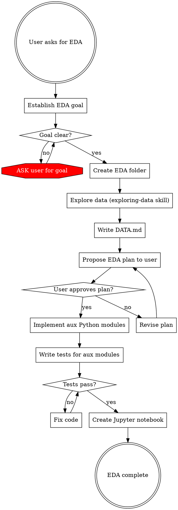

# Creating EDA Notebooks

## Overview

Goal-driven exploratory data analysis that produces a structured folder with a Jupyter notebook, auxiliary Python modules, tests, and a data summary. Core principle: **EDA without a clear goal is wasted effort — always establish intent before touching data.**

## When to Use

- User explicitly asks to "perform EDA", "do exploratory data analysis", or "create an EDA notebook"
- User asks to explore a dataset with analysis/visualization in mind

**Do NOT use when:**
- User just wants to understand data structure (use `exploring-data` skill instead)
- User wants a one-off chart or query (just write the code directly)

## Workflow



## Phase 1: Establish the Goal

**STOP. Do not touch the data yet.**

Ask the user what they want to learn. EDA is not aimless browsing — it needs a question to answer. Examples of good goals:

- "Understand customer churn patterns to build a prediction model"
- "Find seasonal trends in sales to plan inventory"
- "Assess data quality before building an ML pipeline"
- "Identify which features correlate with conversion"

If the user says "just explore it" or gives a vague goal, push back:

> "To make this EDA useful, I need to know what you plan to do with the insights. For example: are you preparing data for a model? Looking for anomalies? Trying to understand user behavior? The goal determines which statistics, plots, and cross-cuts are worth producing."

**If the user still can't articulate a goal after pushback**, help them by offering concrete options based on the dataset type:

> "Here are common goals for a dataset like this: (1) assess data quality and completeness, (2) understand distributions and outliers for modeling, (3) find patterns for a business report. Which fits closest, or should I combine them?"

**Do NOT proceed until you have a clear, stated goal.** Helping the user formulate a goal is part of this phase — blocking without assistance is not acceptable.

## Phase 2: Create the EDA Folder

Create a folder named `EDA_{short_request_description}_{YYYY-MM-DD}` where:
- `short_request_description` is a snake_case summary of the goal (e.g., `churn_analysis`, `sales_trends`)
- Date is today's date

Example: `EDA_churn_analysis_2025-06-15`

The folder will contain all artifacts. Structure after completion:

```
EDA_churn_analysis_2025-06-15/
    DATA.md                  # Data structure summary (from Phase 3)
    eda.ipynb                # Single Jupyter notebook (layout + visualization)
    aggregations.py          # Aux module: data aggregation functions
    preprocessing.py         # Aux module: cleaning/transformation functions
    test_aggregations.py     # Tests for aggregations module
    test_preprocessing.py    # Tests for preprocessing module
```

**All files live in the same flat folder.** No nested `src/`, `tests/`, or `notebooks/` directories.

## Phase 3: Explore the Data

**REQUIRED SUB-SKILL:** Use the `exploring-data` skill for this phase.

Run the full exploring-data workflow:
1. Map directory structure
2. Inspect each file (schema, types, samples)
3. Collect unknowns — ask user about ambiguous names
4. Produce the data summary

**Save the output as `DATA.md` inside the EDA folder.** This is the canonical data reference for the rest of the EDA.

## Phase 4: Propose the EDA Plan

Based on the goal (Phase 1) and data understanding (Phase 3), propose a concrete EDA plan. The plan should list:

1. **Statistics to compute** — what aggregations, distributions, correlations are relevant to the goal
2. **Plots and visualizations** — specific chart types, what goes on each axis, what the chart answers
3. **Cross-cuts and segments** — which groupings, filters, or comparisons are most informative
4. **Notebook structure** — ordered list of sections the notebook will contain

Present this plan to the user as a numbered list. Example:

```
Proposed EDA plan for churn analysis:

1. **Overview stats**: customer count, transaction volume, date range, churn rate
2. **Churn distribution**: bar chart of churned vs active by signup cohort
3. **Transaction frequency**: histogram of transactions per customer, split by churned/active
4. **Monetary patterns**: box plots of average transaction value by churn status
5. **Time series**: monthly active customers over time with churn overlay
6. **Feature correlations**: heatmap of numeric features colored by correlation with churn
7. **Segment analysis**: churn rate by customer segment (geography, plan type, etc.)

Shall I proceed with this plan, or would you like to add/remove/modify any sections?
```

**Do NOT start implementation until the user approves the plan.** If the user requests changes, revise and re-present.

## Phase 5: Implement Auxiliary Python Modules

Write the data processing code as standalone `.py` files. These files contain **all logic** — aggregations, transformations, cleaning, feature engineering.

### Rules for Aux Modules

1. **Stateless functions only.** No module-level state, no cached data, no stored paths.
2. **All inputs as arguments.** Data, paths, parameters — everything is passed in. Never hardcode file paths or dataset-specific constants inside aux modules.
3. **Return values, not side effects.** Functions return DataFrames/Series/dicts. They do not write files or produce plots.
4. **Use type hints.** Parameters and return types annotated.
5. **Docstrings on every public function.** What it computes, what it expects, what it returns.

Example:

```python
# aggregations.py
import pandas as pd


def compute_churn_rate_by_cohort(
    df: pd.DataFrame,
    date_col: str,
    churn_col: str,
    cohort_col: str,
) -> pd.DataFrame:
    """Compute churn rate grouped by cohort.

    Args:
        df: Transaction/customer DataFrame.
        date_col: Name of the date column.
        churn_col: Name of the boolean churn indicator column.
        cohort_col: Name of the cohort grouping column.

    Returns:
        DataFrame with columns [cohort_col, 'total', 'churned', 'churn_rate'].
    """
    grouped = df.groupby(cohort_col)[churn_col].agg(["sum", "count"]).reset_index()
    grouped.columns = [cohort_col, "churned", "total"]
    grouped["churn_rate"] = grouped["churned"] / grouped["total"]
    return grouped
```

**Why stateless?** Stateless functions are testable with synthetic data, reusable across notebooks, and don't break when paths change.

### Write Tests

Every aux `.py` file gets a corresponding `test_*.py` file. Tests use small, hand-crafted DataFrames — not the real dataset.

```python
# test_aggregations.py
import pandas as pd
from aggregations import compute_churn_rate_by_cohort


def test_churn_rate_by_cohort():
    df = pd.DataFrame({
        "signup_month": ["Jan", "Jan", "Feb", "Feb", "Feb"],
        "churned": [True, False, True, True, False],
    })
    result = compute_churn_rate_by_cohort(
        df, date_col="signup_month", churn_col="churned", cohort_col="signup_month"
    )
    jan = result[result["signup_month"] == "Jan"]
    assert jan["churn_rate"].iloc[0] == 0.5
    assert jan["total"].iloc[0] == 2


def test_churn_rate_empty_cohort():
    df = pd.DataFrame({
        "signup_month": pd.Series([], dtype=str),
        "churned": pd.Series([], dtype=bool),
    })
    result = compute_churn_rate_by_cohort(
        df, date_col="signup_month", churn_col="churned", cohort_col="signup_month"
    )
    assert len(result) == 0
```

Run tests with `pytest` before creating the notebook. **All tests must pass before proceeding.**

## Phase 6: Create the Jupyter Notebook

The notebook is the **presentation layer** — it arranges visualizations and narrative, but delegates computation to aux modules.

### Notebook Structure Rules

1. **Single notebook** named `eda.ipynb`. Do not split into multiple notebooks.
2. **Markdown cells before every code cell** explaining what the visualization shows and why it matters for the goal.
3. **Imports and data loading** in the first code cell. All subsequent cells should not re-read data.
4. **Visualization only in notebook.** The notebook calls aux module functions to get processed data, then plots it. No complex aggregation logic in notebook cells. Trivial introspection like `len(df)`, `df.shape`, `df.columns`, or `df.describe()` is fine inline — but any groupby, merge, pivot, or multi-step transformation must be in an aux module.
5. **matplotlib and seaborn only.** Do not use plotly, bokeh, altair, or pandas `.plot()`. Use `matplotlib.pyplot` and `seaborn` for all charts.
6. **Clear section headers** as markdown cells matching the approved EDA plan sections.

### Notebook Template

```python
# Cell 1 (code): Setup
import pandas as pd
import matplotlib.pyplot as plt
import seaborn as sns

from aggregations import compute_churn_rate_by_cohort
from preprocessing import clean_transactions

# Load and prepare data
df = pd.read_csv("path/to/data.csv")
df = clean_transactions(df)
```

```markdown
# Cell 2 (markdown):
## 1. Overview Statistics
Key metrics to frame the analysis: total customers, transaction volume, date range.
```

```python
# Cell 3 (code): Overview stats visualization
# ... call aux functions, then plot with matplotlib/seaborn
```

```markdown
# Cell 4 (markdown):
## 2. Churn Distribution by Cohort
How does churn rate vary across signup cohorts? This helps identify
whether churn is a recent problem or a long-standing pattern.
```

```python
# Cell 5 (code): Churn by cohort visualization
cohort_stats = compute_churn_rate_by_cohort(df, ...)
fig, ax = plt.subplots(figsize=(10, 6))
sns.barplot(data=cohort_stats, x="signup_month", y="churn_rate", ax=ax)
ax.set_title("Churn Rate by Signup Cohort")
ax.set_ylabel("Churn Rate")
plt.tight_layout()
plt.show()
```

Continue this pattern for each section in the approved plan.

## Quick Reference

| Phase | What | Output | Blocked Until |
|---|---|---|---|
| 1. Goal | Understand why we're doing EDA | Clear goal statement from user | User provides goal |
| 2. Folder | Create `EDA_{name}_{date}/` | Empty folder with correct name | Goal established |
| 3. Data | Explore data with `exploring-data` skill | `DATA.md` in EDA folder | Folder created |
| 4. Plan | Propose stats, plots, sections | Numbered plan presented to user | Data explored |
| 5. Implement | Write aux `.py` modules + tests | Tested Python modules | User approves plan |
| 6. Notebook | Create `eda.ipynb` with visualizations | Complete notebook | Tests pass |

## Common Mistakes

| Mistake | Fix |
|---|---|
| Starting EDA without a clear goal | Phase 1 is mandatory. Push back on vague goals. |
| Putting aggregation logic in notebook cells | All logic in aux `.py` files. Notebook only plots. |
| Hardcoding file paths in aux modules | Pass paths and data as arguments. |
| Using plotly/bokeh/pandas .plot() | Use matplotlib + seaborn only. |
| Creating multiple notebooks | One notebook: `eda.ipynb`. Use markdown sections. |
| Skipping the plan approval step | Do NOT implement until user says "go". |
| Creating nested `src/` or `tests/` dirs | Flat folder. All files at same level. |
| Writing aux functions with side effects | Functions return data. No file writes, no plots. |
| Not testing aux modules | Every `.py` module gets a `test_*.py`. Run pytest. |
| Skipping `exploring-data` skill for data exploration | Phase 3 REQUIRES the `exploring-data` skill. Do not freestyle. |

## Red Flags — STOP

- You're about to write complex pandas logic in a notebook cell → Move it to an aux module
- You're about to import plotly or call `df.plot()` → Use matplotlib/seaborn
- You're about to create a second notebook → Add a section to `eda.ipynb` instead
- You're about to implement visualizations without user approval → Present the plan first
- You don't know what the EDA is for → Ask the user for the goal
