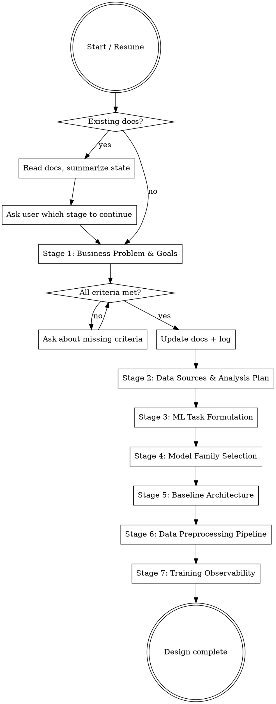

# Designing ML Pipelines

## Overview

Collaborative design skill that produces a comprehensive ML pipeline design document through structured conversation. Walks through 7 stages — from business problem to training observability — ensuring nothing critical is missed before implementation begins.

Core principle: **every design decision is documented with rationale, and the user approves each stage before moving on.**

**Announce at start:** "I'm using the designing-ml-pipelines skill to create an ML pipeline design document."

## When to Use

- User wants to build a new ML pipeline or model training system
- User wants to redesign or significantly update an existing ML pipeline
- User says "let's design", "let's plan", or "I need a model for..."
- User has a business problem they want to solve with ML

**Do NOT use when:**
- User wants to explore data only (use `exploring-data`)
- User wants to build a data processing pipeline without ML (use `building-data-pipelines`)
- User already has a complete design and wants to implement (use `writing-plans`)
- User wants a one-off prediction or quick experiment (just write the code)

## Deliverables

| File | Created at | Purpose |
|------|-----------|---------|
| `docs/design/{short_name}_ml_design.md` | Stage 1, updated every stage | Main design document |
| `docs/design/{short_name}_decision_log.md` | Stage 1, updated every stage | Timestamped decision log |
| `docs/design/{short_name}_data_analysis.md` | Stage 2 | EDA plan |
| `docs/design/{short_name}_data_pipeline.md` | Stage 6 | Preprocessing spec |

**Templates** (read when creating each deliverable):
- [design-doc-template.md](design-doc-template.md) — main design document structure
- [decision-log-template.md](decision-log-template.md) — decision log structure
- [data-analysis-plan-template.md](data-analysis-plan-template.md) — EDA plan structure (Stage 2)
- [data-pipeline-template.md](data-pipeline-template.md) — preprocessing pipeline spec (Stage 6)

## Process Flow

**Between every stage:** verify completion criteria, update both documents, get user approval.

## Resume Protocol

If user provides existing design documents or points to a folder:

1. Read both `_ml_design.md` and `_decision_log.md` fully
2. Summarize to user: which stages are complete, in progress, or TODO
3. Ask user which stage to continue from — do NOT assume

## Stage 1: Business Problem & Goals

**Purpose:** Understand what this pipeline is for and how success will be measured.

Ask the user about:
- Problem statement (what business problem does this solve?)
- Functional goals (what should the model do?)
- Non-functional goals — prompt for: latency, throughput, compute budget, training timeline, interpretability, fairness. "Not applicable" is a valid answer; mark as TBD rather than blocking.
- Non-goals (what is explicitly out of scope)
- Success metrics (measurable business metrics)

**Completion criteria — all must be present in the doc:**
- [ ] Problem statement (1-3 sentences, clear enough for a new team member)
- [ ] At least 1 functional goal
- [ ] Non-functional goals listed (user may say N/A for some)
- [ ] Non-goals listed (at least 1)
- [ ] At least 1 measurable success metric

## Stage 2: Data Sources & Analysis Plan

**Purpose:** Understand available data and plan exploration.

Ask about:
- All available data sources (name, format, size, freshness, access method)
- For each source: what it contains, known quality issues, relationship to problem
- Potentially important data that's missing
- What analyses would help understand the data before modeling

**Completion criteria:**
- [ ] At least 1 data source documented (name, format, approximate size, contents)
- [ ] Known quality issues noted per source (or "none known")
- [ ] Missing/desired data discussed
- [ ] Data analysis plan saved to `docs/design/{short_name}_data_analysis.md`
- [ ] User approved the data analysis plan

The data analysis plan is a **separate deliverable** for handoff to an EDA agent. It must contain concrete, actionable steps — not vague "explore the data." Each step answers a specific question.

Good: "Plot distribution of target variable to check class balance"
Bad: "Explore the target variable"

## Stage 3: ML Task Formulation

**Purpose:** Translate business problem into a precise ML task.

Cover:
- Model inputs (features, modalities, context)
- Model outputs (predictions, scores, generated content)
- What one training example looks like (concrete)
- Alternative formulations (e.g., "reduce churn" could be classification, survival analysis, ranking)
- Which formulation is chosen and why

**Completion criteria:**
- [ ] Model inputs defined (what data goes in, at what granularity)
- [ ] Model outputs defined (format, dimensionality)
- [ ] Training example structure described (one concrete example)
- [ ] At least 2 alternative formulations with brief pros/cons
- [ ] Final formulation chosen with rationale

Present alternatives — the user might not realize their "classification" problem could also be framed as ranking or regression. Getting this wrong wastes everything downstream.

## Stage 4: Model Family Selection

**Purpose:** Choose the broad class of model and define training/eval metrics.

Cover:
- Problem type: generative vs discriminative, specific approach (regression, classification, detection, generation, mix)
- 2-3 model family options with pros, cons, tradeoffs
- Iterate based on user feedback
- Training metric (what the loss optimizes) and auxiliary eval metrics

**Completion criteria:**
- [ ] Problem type clearly stated
- [ ] 2-3 model family options with pros/cons/tradeoffs
- [ ] User's chosen model family recorded with rationale
- [ ] Primary training metric defined
- [ ] At least 2 auxiliary eval metrics defined

Be opinionated but respect the user's decision. If the user's choice seems risky, note concerns in the decision log but proceed. Tradeoffs should cover: expected performance, training cost, data requirements, implementation complexity, interpretability.

## Stage 5: Baseline Model & Architecture

**Purpose:** Define the specific starting model — the first thing to train.

Cover:
- 2-3 specific architectures within the chosen family
- For each: capacity (parameters), infra requirements (GPU type/count, memory), minimum dataset size
- Recommended starting point and why

**Completion criteria:**
- [ ] 2-3 specific architectures with tradeoffs
- [ ] For each: capacity, infra requirements, dataset size guidance
- [ ] Baseline architecture chosen with rationale
- [ ] Key hyperparameter ranges noted (learning rate, batch size — rough starting points)

The baseline should be the **simplest thing that could work**. Resist starting with the biggest model. Goal: get a training loop running end-to-end quickly, then iterate.

## Stage 6: Data Preprocessing & Dataset Pipeline

**Purpose:** Define the exact transform sequence from raw data to training-ready dataset.

Cover:
- Step-by-step preprocessing pipeline: each transform, its input, its output, its purpose
- Data split strategy: 2-3 options with tradeoffs (temporal, stratified, group-aware, random)
- Data validation checks at each stage

**Completion criteria:**
- [ ] Preprocessing pipeline as ordered sequence of transforms
- [ ] Each transform has: input, output, purpose
- [ ] 2-3 split strategies proposed with pros/cons
- [ ] Split strategy chosen with rationale
- [ ] Key data validation checks listed

**Deliverable:** Save to `docs/design/{short_name}_data_pipeline.md` — actionable enough to hand off to a pipeline agent or implement directly.

"Clean the data" is not a step. "Remove rows where `timestamp` is null or before 2020-01-01" is.

## Stage 7: Training Observability

**Purpose:** Define what to monitor during training.

Cover:
- Training curves: which losses and metrics to plot, logging frequency
- Sample-level inspection: visualize predictions vs ground truth on fixed samples during training
- Experiment tracking approach

**Completion criteria:**
- [ ] Training curves defined (which metrics, logging frequency)
- [ ] Sample inspection plan defined (how many samples, which samples, GT vs prediction)
- [ ] Experiment tracking approach chosen

Propose concrete visualizations. Bad: "monitor training loss." Good: "plot train loss and val loss on same chart, logged every 100 steps, with early stopping patience visible as a vertical line."

## Cross-Cutting Rules

### Document Management
- Update main doc and decision log after every meaningful decision or stage transition
- Both documents together must be sufficient to resume without chat history
- Main doc uses `#` headers per stage; incomplete stages show `TODO`
- Decision log entries are timestamped: what was decided and why

### Backtracking
If a later-stage decision contradicts an earlier stage, explicitly tell the user:
> "This contradicts what we decided in Stage N: [quote]. How would you like to handle this?"

Let the user decide: update the earlier stage, change the current decision, or note as known tension. Log all backtracking in the decision log.

### Stage Transitions
- Before moving on, verify all completion criteria are met
- If criteria are marked TBD (user explicitly deferred) — note and proceed
- If criteria are simply missing (not discussed) — ask before moving on

## Common Mistakes

| Mistake | Fix |
|---------|-----|
| Jumping to model selection before defining the problem | Complete Stages 1-3 before discussing models |
| Vague data analysis plan | Each step must answer a specific question with a concrete action |
| Only one task formulation considered | Always present 2+ alternatives with tradeoffs |
| Starting with the biggest model | Baseline = simplest thing that could work |
| Abstract preprocessing steps | Every transform needs specific input/output/purpose |
| "Monitor loss" as observability plan | Define exact charts, logging frequency, sample inspection |
| Skipping non-goals | At least 1 non-goal shows scope was actively considered |
| Not logging decisions | Every decision gets a timestamped entry with rationale |
| Moving on with missing criteria | Ask about gaps before advancing to next stage |
| Not checking for contradictions | Later decisions may invalidate earlier ones — flag explicitly |
