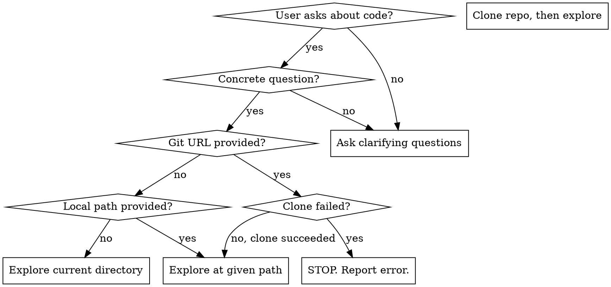

# Exploring Codebases

## Overview

Structured technique for answering specific questions about code repositories. Exploration must be driven by a concrete request - never explore aimlessly.

**Core principle:** Answer exactly what was asked, with code references. No assumptions. No result is also a result.

## When to Use



**Use when:**
- User asks how something works in a codebase
- User asks where specific functionality lives
- User asks to investigate code for a specific purpose
- User provides a git URL to explore

**Reject and ask clarifying questions when request is ambiguous:**
- "Explore this repo" - explore for WHAT?
- "Look at this code" - look for WHAT?
- "Inspect this project" - what do you want to know?
- "What can you tell me about this codebase?" - what specifically?

Ask: "What specific aspect of the codebase do you want to understand?" Suggest 2-3 concrete angles they might care about (architecture, specific feature, dependencies, etc.).

## Source Resolution

1. **Git URL provided** (e.g., `https://github.com/org/repo.git`): Clone to `/tmp/explore-<repo-name>`, then treat as local. If clone fails, **STOP immediately** - report the error and do not proceed.
2. **Local path provided** (e.g., `/home/user/projects/foo`): Use directly.
3. **No path given**: Use current working directory.

## Exploration Rules

### Clearly Label Repository Boundaries

Start with code that lives in the repository itself. When answering requires following code into external dependencies (`node_modules/`, `vendor/`, etc.), you may do so, but **clearly label what is in-repo vs external** in your response.

- Prefix external code references with the dependency name: `router (external) — lib/layer.js:28`
- When transitioning to external code, note it explicitly: "The implementation continues in the `router` package (v2.2.0), an external dependency."
- This helps the user understand which code they own vs what comes from dependencies.

### No Assumptions

- If code doesn't answer the question, say so directly: "I did not find X in this codebase."
- Do NOT guess what the code might do based on naming conventions
- Do NOT suggest how to implement missing features - the user asked what EXISTS, not what COULD exist
- Do NOT extrapolate behavior from documentation alone - find the actual code
- No result IS a result. Report it clearly.

### Answer Only What Was Asked

- Do NOT provide unsolicited implementation advice
- Do NOT suggest improvements to the code
- Do NOT explain how to add features that don't exist
- If the user asks "where is X?" and X doesn't exist, the answer is "X does not exist in this codebase" - not "here's how you could add X"

## Output Format

Structured markdown response:

```markdown
## [Question restated concisely]

[Direct answer with code references]

### [Sub-topic if needed]

The function `handleRequest` at `lib/router/layer.js:28` does...
```

### Code References

- Use `relative/path/to/file.ext:LINE` format (e.g., `lib/application.js:152` or `lib/application.js:152-160`)
- Always relative to repo root - never absolute paths like `/tmp/...` or `/home/...`

### When Feature Doesn't Exist

```markdown
## [Question]

This codebase does not implement [feature]. I searched for:
- [what you searched for]
- [patterns you looked for]
- [files you checked]

No matching code was found.
```

Do NOT follow this with implementation suggestions.

## Common Mistakes

| Mistake | Fix |
|---------|-----|
| Exploring without a concrete question | Ask clarifying questions first |
| Quoting external dependency code without labeling it | Clearly mark what's in-repo vs external |
| Suggesting how to add missing features | Just report the feature doesn't exist |
| Using absolute file paths in references | Use paths relative to repo root |
| Making assumptions about code behavior | Only state what the code explicitly shows |
| Paraphrasing code instead of referencing it | Reference exact file:line, quote verbatim if showing code |
