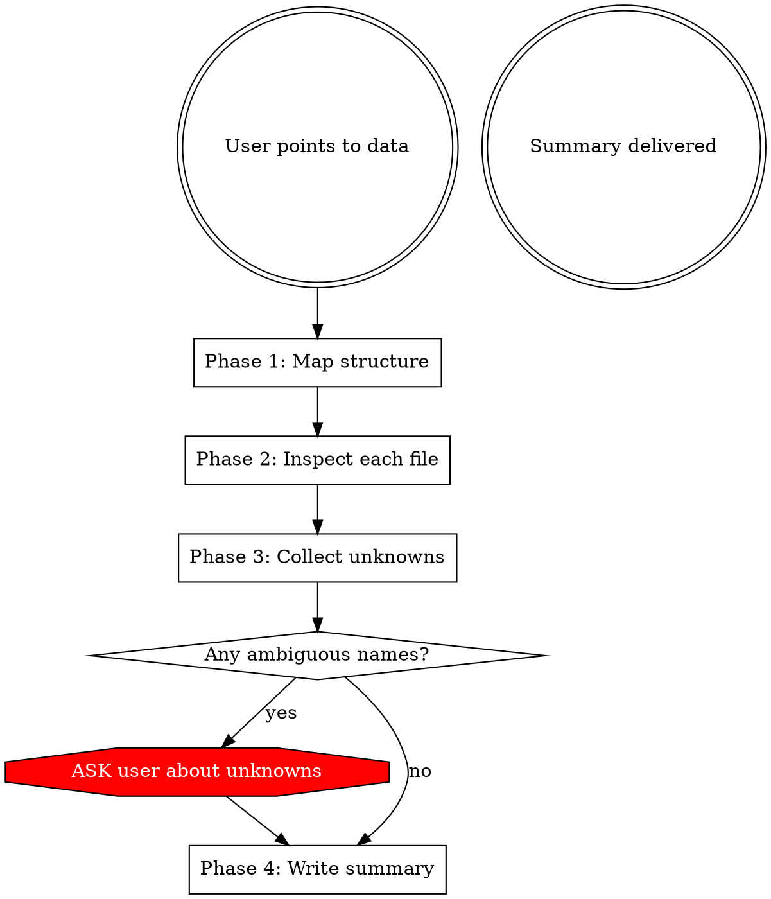

# Exploring Data

## Overview

Systematic data exploration that produces a self-sufficient developer summary. Core principle: **never assume the meaning of ambiguous names — ask the user explicitly.**

## When to Use

- User points you at a dataset directory, CSV, JSON, YAML, Parquet, or other data files
- User asks you to "understand", "explore", "document", or "summarize" data
- You need to understand data before writing code against it
- You encounter unfamiliar column names, keys, abbreviations, or domain terms

## The Iron Rule

**If you are not 100% certain what a name means, ASK the user. Do NOT guess.**

Abbreviations, acronyms, short column names, domain jargon, tier labels, stage names, status codes — all of these MUST be confirmed with the user if their meaning is not self-evident.

"Self-evident" means a general-purpose developer would know it without domain context. `timestamp`, `user_id`, `email` are self-evident. `t1`, `geo_tier`, `acq`, `cvr`, `PLN_PRO`, `cta_main` are NOT.

## Workflow



### Phase 1: Map Structure

Explore the directory tree. For each level, note:
- Directory names and nesting (e.g. `raw/` vs `processed/`)
- File types present (CSV, JSON, YAML, Parquet, TXT, etc.)
- Any README or metadata files

Output: a tree listing with file sizes/types.

### Phase 2: Inspect Each File

For each data file:

**CSV files:**
- Read the header row and first 5-10 data rows
- Note column names, inferred types, nullability
- Identify embedded structures (e.g. JSON-in-CSV)
- Note delimiter, encoding, quoting style

**JSON files:**
- Read the full structure (or first N records for arrays)
- Map all keys at each nesting level
- Note array vs object at top level
- Identify enums (fields with a small set of repeated values)

**YAML files:**
- Read full structure
- Map all keys and their types
- Note list vs scalar vs nested object for each key

**Other formats:**
- Parquet: read schema (column names, types) and row count
- SQLite: list tables, read schema for each
- Text files: note format, line structure

### Phase 3: Collect Unknowns

**This is the critical phase.** Go through EVERY name you encountered:

For each column name, key name, enum value, directory name, file name:
- Is the meaning obvious to a general-purpose developer? → Mark as known
- Is it an abbreviation, acronym, domain term, or coded value? → Mark as **unknown**

**Common traps — these are NEVER self-evident:**
- Short abbreviations: `src`, `dur`, `evt`, `acq`, `ret`, `cvr`, `val`
- Tier/level labels: `t1`, `t2`, `tier_1`, `level_a`
- Status/stage codes: `act`, `rev`, `conv`
- Product codes: `PLN_PRO`, `SKU_123`
- Element IDs: `cta_main`, `btn_hero`
- Metric names in composite keys: `web_t1`, `mob_t2`
- Filter/config values: `exclude_internal`, `min_session_dur`
- Cohort definitions: `signup_week`, `first_purchase`

**Present ALL unknowns to the user as a numbered list and ask for clarification.** Group by file for readability.

Example:
```
I found several names I'm not sure about. Could you clarify:

From events.csv:
1. `evt_type` — is this "event type"? What are all possible values beyond pg_view, btn_clk, conv?
2. `src` — does this mean platform (web/mobile) or traffic source (organic/paid)?
3. `dur_ms` — duration of what exactly? Page load? User session? Time on element?
4. `cta_main` — what does CTA stand for in your domain? What is the "main" CTA?
5. `PLN_PRO` — what product/plan does this SKU represent?

From dau.yaml:
6. `geo_tier` — what are the tier definitions? (t1 = which countries?)
7. `min_session_dur: 10` — is this seconds or milliseconds?

From funnel_snapshot.json:
8. `acq`, `act`, `ret_d7`, `rev` — what do these stage names stand for?
9. `cohort_def: signup_week` — does this mean cohorts are grouped by the week they signed up?
```

**Do NOT proceed to Phase 4 until the user answers.** If the user says "just guess" or "use your best judgment", then and only then may you infer — but clearly mark each inference as an assumption in the summary.

### Phase 4: Write Summary

Produce a summary with these sections, in this order:

#### 1. Quick Start (for developers)
- Directory tree
- One-liner per file: what it contains, how to parse it
- Code snippet showing how to load each file format present. Example:

```python
# Load events
import csv, json
with open("raw/events.csv") as f:
    reader = csv.DictReader(f)
    for row in reader:
        row["meta"] = json.loads(row["meta_json"])  # parse nested JSON

# Load metrics
import yaml
with open("raw/metrics/dau.yaml") as f:
    metrics = yaml.safe_load(f)

# Load funnel
import json
with open("processed/funnel_snapshot.json") as f:
    funnel = json.load(f)
```

Adapt the snippet to the actual files and formats in the dataset. The goal: a developer copies this, runs it, and has all data loaded.

#### 2. File-by-File Schema
For each file:
- **Format & parsing notes** (delimiter, encoding, nested structures)
- **Schema table**: name | type | description (using **confirmed** meanings from user answers)
- **Enum values**: list all observed values with confirmed meanings
- **Sample data**: 2-3 representative rows

#### 3. Cross-File Relationships
- Which fields join across files (and which DON'T — call out false friends explicitly)
- Shared dimensions and their alignment
- Temporal alignment (do date ranges overlap?)

#### 4. Assumptions & Caveats
- Any meanings you inferred (if user said to guess) — mark each clearly as `[ASSUMED]`
- Sample size limitations
- Missing data patterns observed (nulls, empty strings, missing keys)
- Fields that may have additional values not seen in the sample

### Handling Large Datasets

For datasets too large to read fully:
- **CSV**: read first 20 rows + last 5 rows, count total rows with `wc -l`
- **JSON arrays**: read first 5 and last 5 elements
- **Directories with many files**: list all, sample 3-5 representative files
- **Always note**: "Examined N of M rows/files — additional values may exist"

## Red Flags — STOP and Ask

If you catch yourself doing any of these, STOP:

- Writing "this likely means..." → ASK instead
- Expanding an abbreviation without confirmation → ASK instead
- Describing what a coded value "represents" → ASK instead
- Assuming tier/level definitions → ASK instead
- Guessing what a metric formula computes → ASK instead

**All of these mean: you are about to build an assumption into the summary that a developer will trust and code against. Wrong assumptions in summaries cause bugs.**

## Common Mistakes

| Mistake | Fix |
|---|---|
| Guessing abbreviation meanings confidently | Ask the user. Always. |
| Producing summary without code examples | Include load/parse snippets for each format |
| Missing nested structures (JSON-in-CSV) | Always check if string columns contain structured data |
| Not noting cross-file join mismatches | Explicitly state which fields DON'T join even if names are similar |
| Skipping the unknowns phase | Phase 3 is mandatory. List unknowns even if you think you know. |
