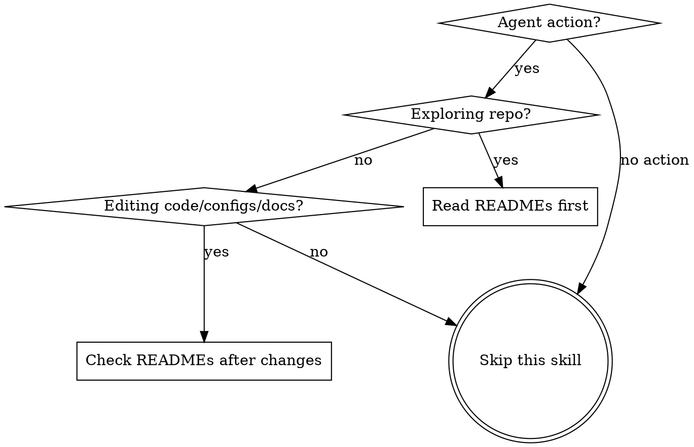
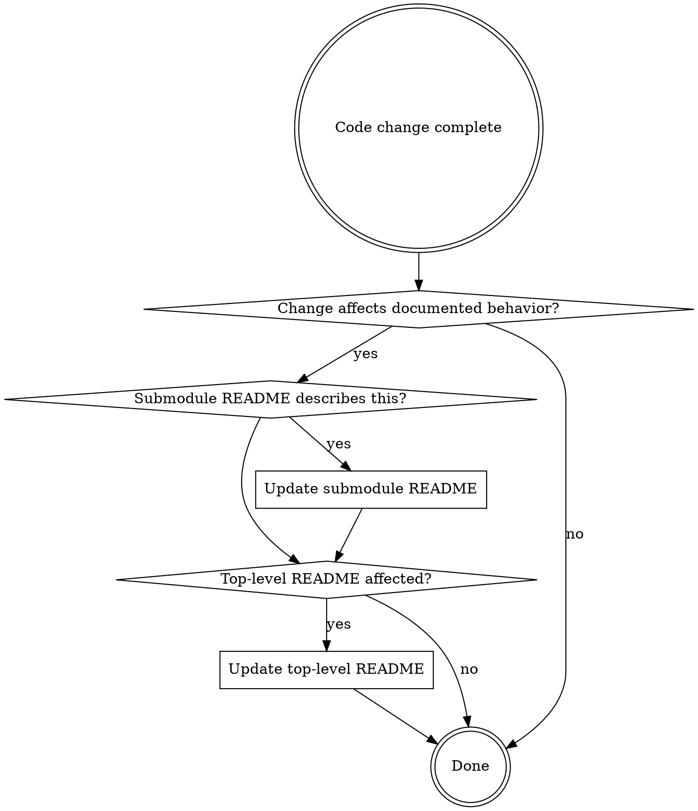

# Maintaining READMEs

## Overview

README files are the primary navigation layer of a repository. They must be read first during exploration and kept in sync with code at all times.

**Core principle:** READMEs are the map. Code is the territory. A stale map is worse than no map — it actively misleads.

**Violating the letter of these rules is violating the spirit of these rules.**

## When to Use



**Applies when:**
- Exploring or orienting in any repository
- Editing any code, configuration, or documentation
- Reviewing code that may have changed documented behavior
- Using a todo list for a multi-step task

**Does NOT apply when:**
- Answering questions without touching the repo
- Running commands that don't change files

## Rule 1: README-First Exploration

**Always read README.md files BEFORE reading code.**

When entering a repository or submodule for the first time in a session:

1. Read the top-level `README.md` first
2. When diving into a submodule/subdirectory, read its `README.md` before reading its code
3. Use READMEs to orient — they tell you what exists and why, so you explore efficiently

**If no README.md exists** in a directory you're entering — that is itself a gap worth noting. Flag it in your response as missing documentation, then proceed to read code. Do NOT silently skip the step and move on as if everything is fine.

```
✅ Read README.md → understand structure → read relevant code
✅ No README.md found → flag missing README → proceed to code
❌ Read code directly → guess at structure → maybe glance at README later
❌ No README.md found → silently skip → read code without mentioning it
```

READMEs are not "supplementary user-facing docs." They are the **authoritative navigation layer** that saves you from blind exploration.

## Rule 2: README Structure

### Top-Level README.md

Lives at the repository root. Contains **only project-level information:**

- Project name and purpose
- How to install / set up / run
- List of submodules/packages with a **one-line description** of each
- Project-wide configuration or conventions
- Links to contributing guides, licenses, etc.

**Must NOT contain:**
- Internal details of any submodule (violates encapsulation)
- API documentation belonging to a submodule
- Implementation details of subsystems

```markdown
## Modules

| Module | Purpose |
|--------|---------|
| `auth/` | User authentication and session management |
| `api/` | REST API endpoints and middleware |
| `lib/` | Shared utilities and helpers |
```

The top-level README is a **table of contents**, not an encyclopedia.

### Submodule README.md

Each submodule/package/major subdirectory should have its own `README.md` containing:

- Purpose of this submodule (what problem it solves)
- External API / public interface (what other modules can use)
- Short description of internal structure (key files/directories)
- Setup or usage specific to this submodule

**Encapsulation rule:** Details live at the level they belong to. A submodule's internals are documented in that submodule's README, never in the parent.

## Rule 3: Staleness Detection

While reading files — even before making any changes — **actively cross-check README claims against actual code.**

This covers two types of problems:
- **Stale content:** README says X, but code shows Y
- **Missing README:** A significant directory has no README at all

If you discover either:

- **Do NOT stop your main task** to fix the README
- **Do NOT silently ignore it**
- **DO note the specific discrepancy** and include it in your response to the user

Format for reporting:

```
⚠️ README staleness detected:
- `path/to/README.md` says [X], but `path/to/actual/code.py` shows [Y]
```

```
⚠️ Missing README:
- `path/to/directory/` has no README.md — this directory would benefit from one
```

This applies even during pure exploration before any code changes. If the map doesn't match the territory — or there is no map at all — say so.

## Rule 4: Post-Change README Verification

After modifying code, configs, or documentation, **check whether READMEs need updating.**



What counts as "affects documented behavior":
- Adding, removing, or renaming a public API / exported function
- Changing a submodule's purpose or scope
- Adding or removing a submodule / major directory
- Changing setup, install, or run instructions
- Modifying configuration file formats or options

**Every change is potentially README-relevant.** Check. Don't assume.

## Rule 5: Todo List Integration

When working with a todo list (TodoWrite), **add an explicit README verification task.**

This is not optional. The task must be added when the todo list is first created or when the first code change is planned.

```
Example todo list:
1. ✅ Implement new auth middleware
2. ✅ Add tests for auth middleware
3. ✅ Update route configuration
4. ⬜ Verify and update READMEs affected by changes   ← REQUIRED
```

The README task goes at the end so all code changes are complete before verification. But it **must exist** — it is not "nice to have."

## Red Flags — STOP and Reconsider

- Reading code files without having read the directory's README first
- Finishing a code change without checking README impact
- Thinking "this is just an internal change, no README update needed"
- Skipping the README todo task because "it's over-engineering"
- Treating READMEs as low-priority "supplementary docs"
- Completing a todo list that has no README verification task

**All of these mean: Go back and follow the rules.**

## Rationalization Prevention

| Excuse | Reality |
|--------|---------|
| "README is low priority, code is authoritative" | Code tells you WHAT. README tells you WHERE and WHY. Read the map first. |
| "This is just an internal change" | Internal changes affect submodule READMEs. Check. |
| "Adding README check to todo is over-engineering" | Skipping it is how READMEs go stale. One task prevents drift. |
| "README updates only matter for public-facing changes" | Submodule READMEs document internal structure too. All levels matter. |
| "I'll remember to check READMEs without a todo task" | You won't. That's why READMEs are stale in every repo. Make it explicit. |
| "The README doesn't cover this area anyway" | Then it should. Missing coverage is itself a staleness signal. |
| "I already know this codebase, don't need READMEs" | READMEs aren't just for you. Keeping them current is the point. |

## Common Mistakes

| Mistake | Fix |
|---------|-----|
| Dumping submodule internals in top-level README | Move details to submodule README, keep only one-line summary at top level |
| Updating code but not the README that describes it | Add README verification as final step in every change |
| Reading all source files before looking at README | Read README first — it tells you which files matter |
| Noticing stale README but not mentioning it | Always report discrepancies, even if not asked |
| Creating submodule without its own README | Every significant directory gets a README |
| Making README todo task optional | It is mandatory when using a todo list for code changes |
